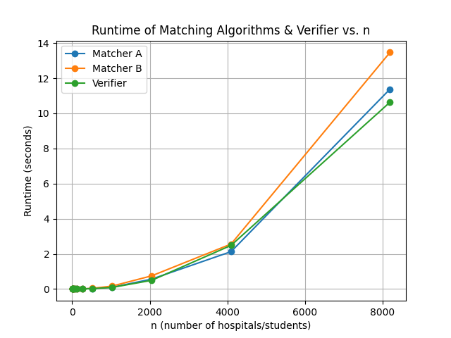

# MatchingAndVerifying

Ryan Froug (83197825) | Yoan Esposito (\<YOAN STUDENT ID\>)

## Programming Assignment 1

<u>All instructions will be with respect to the root directory of the repo</u>

The expected input and output files are in `data/input6.in` and `data/output6.out`

To set up the repo and install dependencies:

- `python -m venv .venv`
- `pip install -r requirements.txt`

To run the matcher and verifier: `python src/main.py data/input6.in`

This will output the matches to the terminal and the `data/output.out` file, and log if it is valid and stable to the console

Example Input:

```
3
1 2 3
1 2 3
1 2 3
1 2 3
1 2 3
1 2 3
```

Example Output:

```
1 1
2 2
3 3
```

Graph Output:



The trend that we noticed is that the graph seems to be increasing exponentially as the input size increases and it is increasing in an n^2 fashion.
