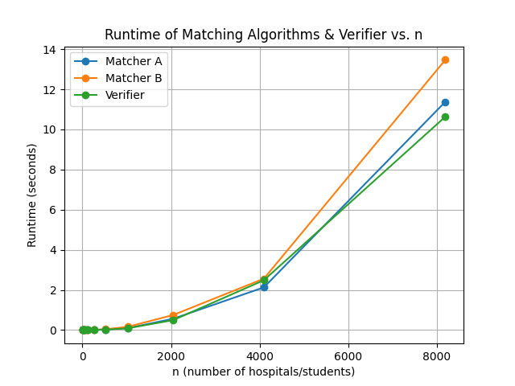

# MatchingAndVerifying

Ryan Froug (83197825) | Yoan Esposito (24603154)

## Programming Assignment 1

<u>All instructions will be with respect to the root directory of the repo</u>

The expected input and output files are in `data/input6.in` and `data/output6.out`

To set up the repo and install dependencies:

- `python -m venv .venv`
- `source .venv/bin/activate`
- `pip install -r requirements.txt`

To run the matcher and verifier (the graph may take a little bit to load): `python src/main.py data/input6.in`

This will output the matches to the terminal and the `data/output.out` file, and log if it is valid and stable to the console

## Note for macOS users

You may run into issues just running the commnads with python, if you cannot run the output despide already having python and all dependencies installed try using `python3`. This is a result of the following: Starting with macOS Monterey 12.3, Apple removed the pre-installed Python 2.7. Since the command `python` was historically reserved for version 2, the system does not automatically link it to `python3` to avoid breaking old scripts that might be incompatible. 

Example Input:

```
3
1 2 3
1 2 3
1 2 3
1 2 3
1 2 3
1 2 3
```

Example Output:

```
1 1
2 2
3 3
```

Graph Output:



The trend that we noticed is that the graph seems to be increasing exponentially as the input size increases and it is increasing in an n^2 fashion.
